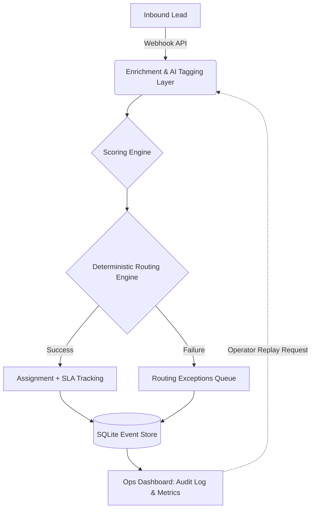

# Event-Driven Revenue Operations System

Real-time inbound lead routing infrastructure with enrichment, scoring, SLA tracking, replayability, and operational observability.

## Architecture



## Core Features

- **Deterministic Routing Engine**: Assigns leads purely on territory, segment rules, and rep capacity.
- **AI-Assisted Enrichment/Classification**: Extracts urgency and buying intent strictly to augment the payload, not to determine the route.
- **SQLite Event Sourcing**: A robust, local-first persistence layer using `better-sqlite3` for an append-only timeline.
- **Weighted Round-Robin Assignment**: Prevents unbalanced rep workloads based on capacity rules.
- **Replayable Routing Pipeline**: Failed or miss-routed leads can be re-run through the engine by an operator for seamless debugging.
- **Operational Exceptions Queue**: Gracefully traps and surfaces routing failures (e.g., missing rep, failed enrichment).
- **SLA Observability**: Built-in timers tracking speed-to-lead and rep response times.
- **Audit/Event Timeline**: A complete, step-by-step lifecycle view of every lead that hits the system.

## Design Philosophy

This project was built to look, feel, and function like real operator infrastructure rather than a flashy consumer demo. 

### Why Routing is Deterministic
While it's tempting to use LLMs to "smart route" leads, AI can hallucinate, leading to nondeterministic behavior where an Enterprise lead in New York suddenly goes to an SMB rep in Nebraska. To prevent this, the system enforces a strict separation of concerns: AI is used to *enrich* the lead with intent tags, but the routing itself relies exclusively on deterministic business rules.

### Why AI is Constrained
By keeping the AI layer constrained to tasks like summarization, use-case extraction, and urgency scoring, the system benefits from the intelligence of language models without sacrificing the predictability required by revenue teams.

### Why Replayability Exists
Reality is messy. Reps go on vacation, territories change, and data enrichment APIs fail. When a lead falls through the cracks, ops teams shouldn't have to manually update Salesforce fields to fix it. This system introduces an **Exceptions Queue** and a **Replay** endpoint. Operators can view a failure, correct the underlying system issue, and simply hit replay—running the exact same webhook payload back through the engine.

### Why Observability Matters
"Automation" isn't enough; ops teams need to know exactly *what* happened and *when*. Instead of just updating a database row, this system uses an event-sourcing model. Every stage of the lead lifecycle—Received, Enriched, Scored, Routed, Assigned, and SLA Met/Missed—is written to an immutable Audit Log. This elevates the project from a workflow script to true revenue operations observability.

---

## Local Setup

```bash
# Install dependencies
npm install

# Run the development server
npm run dev
```

Open [http://localhost:3000](http://localhost:3000) to view the operational dashboard. You can use the "Ingest Webhook Payload" widget to fire test leads into the system and watch them process in real-time.
